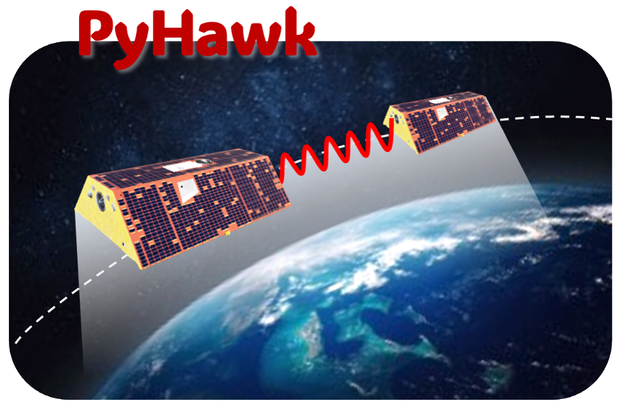
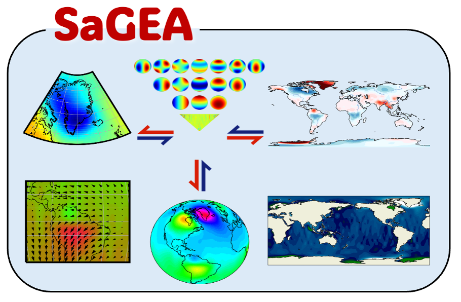

# NCSG Projects

**Numerical Computation and Satellite Gravity Group** develops computational methods, data products, and visualization tools for satellite gravimetry, geodesy, and Earth system mass transport studies.

**Useful links:** 
[GitHub | NSCG Group](https://github.com/NCSGgroup)

  <a class="ncsg-project-card" href="https://github.com/NCSGgroup/PyHawk">
    

      <h3>PyHawk</h3>
      
    

    

      

        Research on GRACE/GRACE-FO satellite gravimetry, gravity field recovery,
        mass transport inversion, and uncertainty assessment.
      

    

  </a>

  <a class="ncsg-project-card" href="/projection_sagea/">
    

      <h3>SaGEA</h3>
      
    

    

      

        Processing pipelines for monthly gravity fields, spherical harmonic coefficients,
        leakage correction, filtering, and regional water storage estimation.
      

    

  </a>

  <a class="ncsg-project-card" href="https://github.com/NCSGgroup/SaGEA-fluid">
    

      <h3>SaGEA-Fluid</h3>
      
    

    

      

        Efficient numerical algorithms for inverse problems, large-scale geophysical
        modelling, uncertainty propagation, and scientific computing.
      

    

  </a>

  <a class="ncsg-project-card" href="https://github.com/NCSGgroup/PyGLDA">
    

      <h3>PyGLDA</h3>
      
    

    

      

        Web-based visualization of satellite gravity data, global grids, time series,
        maps, and geospatial analysis products.
      

    

  </a>

  <a class="ncsg-project-card" href="https://github.com/NCSGgroup">
    

      <h3>More</h3>
      
    

    

      

        Web-based visualization of satellite gravity data, global grids, time series,
        maps, and geospatial analysis products.
      

    

  </a>

