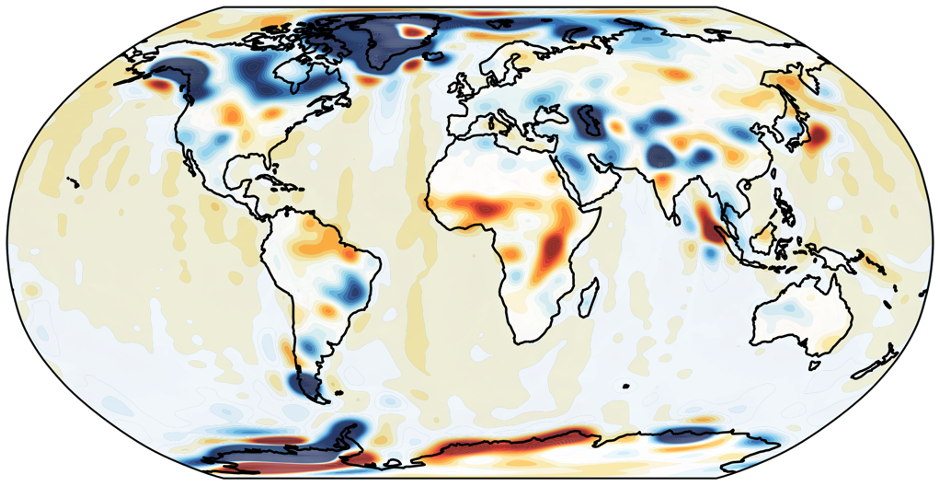
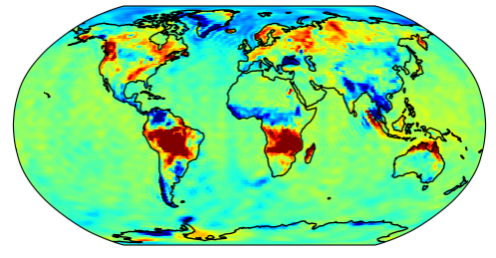

  <a class="ncsg-project-card" href="https://zenodo.org/">
    

      <h3>Hawk: Unconstraint GRACE/GRACE-FO Level-2 products</h3>
      
    

    

      

        Here gives some descrition.
      

    

  </a>

  <a class="ncsg-project-card" href="https://zenodo.org/">
    

      <h3>Assimilation products of GRACE/GRACE-FO observation and w3ra models</h3>
      
    

    

      

        Here gives some descrition.
      

    

  </a>

  <a class="ncsg-project-card" href="https://zenodo.org/">
    

      <h3>FSC: An efficient filter for GRACE/GRACE-FO Level-2 products</h3>
      
    

    

      

        Here gives some descrition.
      

    

  </a>

