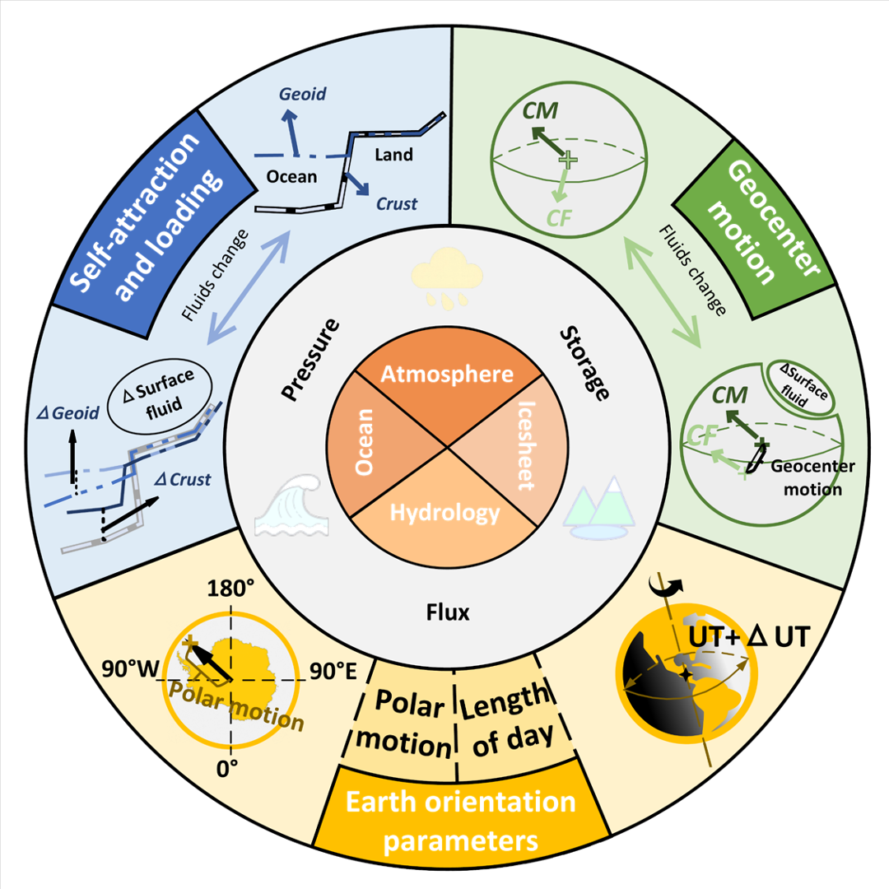
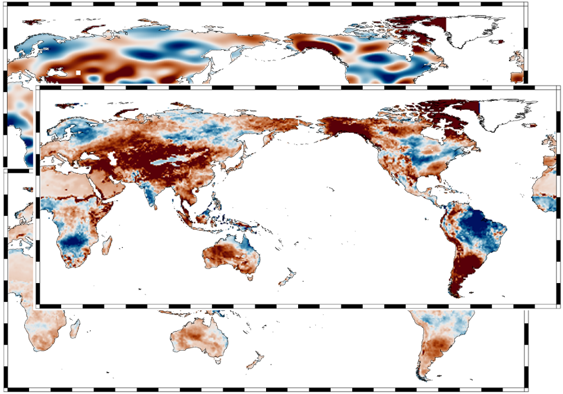

# Software

---

  <a class="ncsg-project-card" href="/pyhawk/">
    

      <h3>PyHawk</h3>
      
    

    

      

        An efficient gravity recovery solver for low-low satellite-to-satellite tracking gravity missions.
      

    

  </a>

  <a class="ncsg-project-card" href="/sagea/">
    

      <h3>SaGEA</h3>
      
    

    

      

        SaGEA is a Python toolbox for post-processing and error assessment of satellite gravity products.
      

    

  </a>

  <a class="ncsg-project-card" href="https://github.com/NCSGgroup/SaGEA-fluid">
    

      <h3>SaGEA-Fluid</h3>
      
    

    

      

        SAGEA-fluid extends SaGEA to include self-attraction and loading effects, geocenter motion, and Earth rotation effects.
      

    

  </a>

  <a class="ncsg-project-card" href="https://github.com/NCSGgroup/PyGLDA">
    

      <h3>PyGLDA</h3>
      
    

    

      

        PyGLDA is a Python platform for assimilating GRACE into hydrological model. 
      

    

  </a>

